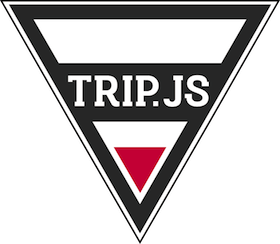

# What is Trip.js

For websites, it's quite common that you need to have a tutorial trip to teach new comers how to user your own services. In addition to this, when there is any new feature coming up, you also need that to make sure your hard works do have been seen and used by users. Same like you, we have been making tons of routine works like that and that's why we are going to make a super lightweight library - Trip.js that you can use for most cases ! Hope you will like it :)

# Browser Support

Trip.js has been tested and it works well on **IE 9+**, **Chrome 32+**, **Firefox 32+** and **Safari 9+**

# Latest version

3.2.2
